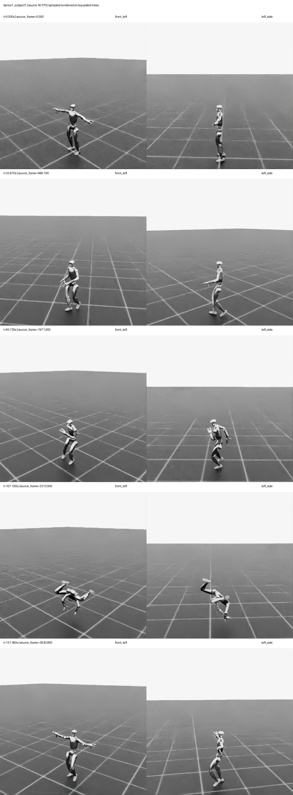
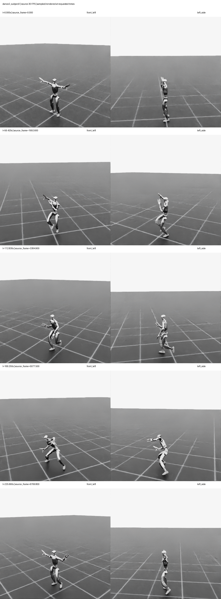
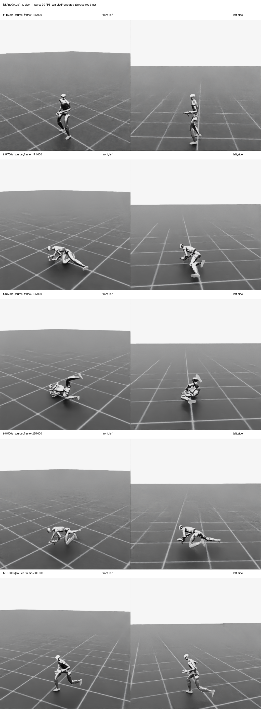
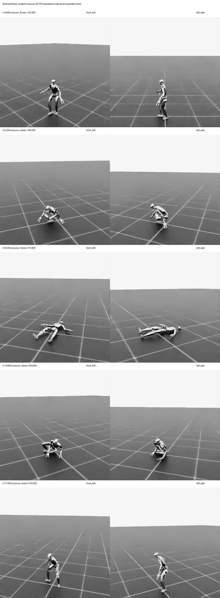

# Phase 1 LAFAN1-to-G1 Visual Validation

Date: 2026-08-09

## Scope

This gate validates the reference-motion foundation only. It does not implement
PPO, a tracking expert, a recovery expert, a mixture gate, or deployment.

The public CSV format is interpreted as root XYZ, root quaternion XYZW, then 29
joint positions at 30 FPS. Isaac Lab's `G1_29DOF_CFG` exposes 43 runtime joints:
the required 29 body joints and 14 hand joints. The body joints are mapped by
name; hand joints stay at their asset defaults.

The validated CSV-to-simulator permutation is:

```text
[0, 3, 6, 9, 13, 17, 1, 4, 7, 10, 14, 18, 2, 5, 8, 11,
 15, 19, 21, 23, 25, 27, 12, 16, 20, 22, 24, 26, 28]
```

## Evidence set

Each row was rendered on the RTX 4090 from a robot-relative front-left camera
and left-side camera. Labels record exact time and fractional source frame.

| Sequence | Times (s) | Purpose |
|---|---|---|
| `dance1_subject1` | 0, 32.87, 65.73, 107.10, 131.46 | broad coverage including an extreme tilted pose |
| `dance2_subject2` | 0, 56.42, 112.83, 169.25, 225.66 | second subject/sequence and varied limb configurations |
| `fallAndGetUp1_subject1` | 4.5, 5.7, 6.5, 8.5, 10.0 | standing, descent, floor, transition, restored upright motion |
| `fallAndGetUp2_subject2` | 4.5, 6.2, 9.03, 14.8, 17.0 | second recovery style with a longer floor phase |

### Dance 1 / subject 1



### Dance 2 / subject 2



### Fall and get up 1 / subject 1



### Fall and get up 2 / subject 2



## Acceptance results

- **Root pose and ground relation:** pass. Upright samples have plausible pelvis
  height; recovery samples move continuously into and out of floor-level poses.
- **Left/right and joint order:** pass. Contrasting arm and leg configurations
  remain anatomically consistent in both views; no swapped or chained joints
  were observed. The mapper also rejects missing, duplicated, or unknown extras.
- **Articulation/FK integrity:** pass. No detached links, stretched geometry, or
  impossible kinematic discontinuities were visible across 40 rendered views.
- **Camera coverage:** pass. The full robot remains visible for upright, crouched,
  sideways, and supine poses.
- **Timing/interpolation:** pass. Source frame is computed as `time * 30`; the
  evidence includes fractional frames such as 986.1, 5077.5, and 270.9. Unit
  tests independently verify linear root/joint interpolation and quaternion
  SLERP when a 30 FPS reference is queried by a 50 Hz policy clock.
- **Real-data integration:** pass. The remote test suite loads all 14 CSV files
  and passes 13/13 tests on the audited server environment. A negative CLI test
  also confirms an out-of-range timestamp fails before Isaac launches and
  returns a non-zero process status.

## Artifact integrity

```text
ffa90283ad5e471659b13e97545a6ea78115700c4f6a1f05013bb1618a0647fb  dance1_subject1_contact_sheet.png
871efd74240d000dfb10e3ab16ff0745365af383e8c90db0e7732f9cc56fd7c9  dance2_subject2_contact_sheet.png
6353007e555e287f2cd6180702805a084db7a34d3404201845cfb84dd151bf6b  fallAndGetUp1_subject1_contact_sheet.png
c75547c7694a15dd620915d9dbfd5b0daa8673acb5d4ac44b71900835c2fecae  fallAndGetUp2_subject2_contact_sheet.png
```

Full individual PNG frames remain on the data disk at
`/root/gpufree-data/stablemimic_replicate/visualizations/phase1`.

## Known environment behavior

Isaac Sim 5.1 can block during `SimulationApp.close()` in this container after
a successful run. The renderer emits `[PASS]` only after saving its contact
sheet, then uses the repository's bounded 15-second close watchdog to release
the process and GPU. This shutdown workaround does not change reference poses
or render output.
